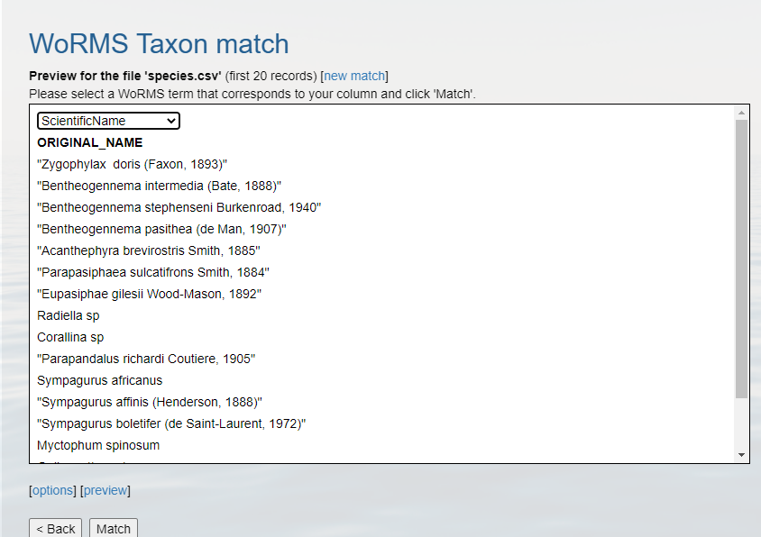

:::::::::::: questions

- How to convert dates to ISO?
- How to match scientific names to WoRMS?
- How to convert latitudes and longitudes to decimal degrees?

:::::::::::::::::::::::

::::::::::: objectives

- Aligning dates to the ISO 8601 standard.
- Matching scientific names to WoRMS.
- Converting latitude and longitude variations to decimal degrees North and East.

::::::::::::::::::::::

Now that you know what the mapping is between your raw data and the Darwin Core standard, it's time to start cleaning up 
the data to align with the conventions described in the standard. The following activities are the three most common 
conversions a dataset will undergo to align to the Darwin Core standard:
1. [Ensuring dates follow the ISO 8601 standard](#getting-your-dates-in-order)
2. [Matching scientific names to an authoritative resource](#matching-your-scientific-names-to-worms)
3. [Ensuring latitude and longitude values are in decimal degrees](#getting-latlon-to-decimal-degrees)

Below is a short summary of each of those conversions as well as some example conversion scripts. The exercises are 
intended to give you a sense of the variability we've seen in datasets and how we went about converting them. While the
examples use the [pandas package for Python](https://pandas.pydata.org/) and the [tidyverse collection of packages for R](https://www.tidyverse.org/)
(in particular the [lubridate](https://cloud.r-project.org/web/packages/lubridate/lubridate.pdf) package),
those are not the only options for dealing with these conversions but simply the ones we use more frequently in our 
experiences. 


## Getting your dates in order
Dates can be surprisingly tricky because people record them in many different ways. For our purposes we must follow 
[ISO 8601](https://en.wikipedia.org/wiki/ISO_8601) which means using a four digit year, two digit month, and two digit 
day with dashes as separators (i.e. `YYYY-MM-DD`). You can also record time in ISO 8601 but make sure to include the time 
zone which can also get tricky if your data take place across time zones and throughout the year where daylight savings 
time may or may not be in effect (and start and end times of daylight savings vary across years). There are packages in 
R and Python that can help you with these vagaries. Finally, it is possible to record time intervals in ISO 8601 using a 
slash (e.g. `2022-01-02/2022-01-12`). Examine the dates in your data to determine what format they are following and what 
amendments need to be made to ensure they are following ISO 8601. Below are some examples and solutions in Python and R 
for them.

ISO 8601 dates can represent moments in time at different resolutions, as well as time intervals, which use "/" as a separator. Date and time are separated by "T". Timestamps can have a time zone indicator at the end. If not, then they are assumed to be local time. When a time is UTC, the letter "Z" is added at the end (e.g. 2009-02-20T08:40Z, which is the equivalent of 2009-02-20T08:40+00:00). 

:::::::::::: callout
### :pushpin: Tip 

Focus on getting your package of choice to read the dates appropriately. While you can use 
[regular expressions](https://en.wikipedia.org/wiki/Regular_expression)
to replace and substitute strings to align with the ISO convention, it will typically save you time if you work in 
your package of choice to translate the dates.

:::::::::::::::::::::
 
| Darwin Core Term | Description | Example   |
|------------------|-------------|-----------|
| [eventDate](https://dwc.tdwg.org/list/#dwc_eventDate) | The date-time or interval during which an Event occurred. For occurrences, this is the date-time when the event was recorded. Not suitable for a time in a geological context. | `1963-03-08T14:07-0600` (8 Mar 1963 at 2:07pm in the time zone six hours earlier than UTC).<br/>`2009-02-20T08:40Z` (20 February 2009 8:40am UTC).<br/>`2018-08-29T15:19` (3:19pm local time on 29 August 2018).<br/>`1809-02-12` (some time during 12 February 1809).<br/>`1906-06` (some time in June 1906).<br/>`1971` (some time in the year 1971).<br/>`2007-03-01T13:00:00Z/2008-05-11T15:30:00Z` (some time during the interval between 1 March 2007 1pm UTC and 11 May 2008 3:30pm UTC).<br/>`1900/1909` (some time during the interval between the beginning of the year 1900 and the end of the year 1909).<br/>`2007-11-13/15` (some time in the interval between 13 November 2007 and 15 November 2007). |

::::::::::::::::::::::::::::::::: challenge
### Examples

Below are a few examples in R and Python for converting commonly represented dates to ISO-8601.

::::::::::::::::: solution

::::::::::::::::: tab

### Python

When dealing with dates using pandas in Python it is best to create a Series as your time column with the appropriate 
datatype. Then, when writing your file(s) using [.to_csv()](https://pandas.pydata.org/docs/reference/api/pandas.DataFrame.to_csv.html)
you can specify the format which your date will be written in using the `date_format` parameter. 

The examples below show how to use the [pandas.to_datetime()](https://pandas.pydata.org/docs/reference/api/pandas.to_datetime.html)
function to read various date formats. The process can be applied to entire columns (or Series) within a DataFrame.

1. `01/31/2021 17:00 GMT`
 
   This date follows a typical date construct of `month`**/**`day`**/**`year` `24-hour`**:**`minute` `time-zone`. The 
   pandas `.to_datetime()` function will correctly interpret these dates without the `format` parameter.
 
   ```python
   import pandas as pd
   df = pd.DataFrame({'date':['01/31/2021 17:00 GMT']})
   df['eventDate'] = pd.to_datetime(df['date'], format="%m/%d/%Y %H:%M %Z")
   df
   ```
   ```output
                       date                 eventDate
       01/31/2021 17:00 GMT 2021-01-31 17:00:00+00:00
   ``` 

2. `31/01/2021 12:00 EST`

   This date is similar to the first date but switches the `month` and `day` and identifies a different `time-zone`.
   The construct looks like `day`**/**`month`**/**`year` `24-hour`**:**`minute` `time-zone`
   ```python
   import pandas as pd
   df = pd.DataFrame({'date':['31/01/2021 12:00 EST']})
   df['eventDate'] = pd.to_datetime(df['date'], format="%d/%m/%Y %H:%M %Z")
   df
   ```
   ```output
                      date                 eventDate
      31/01/2021 12:00 EST 2021-01-31 12:00:00-05:00
   ``` 

3. `January, 01 2021 5:00 PM GMT`
   
   ```python
   import pandas as pd
   df = pd.DataFrame({'date':['January, 01 2021 5:00 PM GMT']})
   df['eventDate'] = pd.to_datetime(df['date'],format='%B, %d %Y %I:%M %p %Z')
   df
   ```
   ```output
                              date                 eventDate
      January, 01 2021 5:00 PM GMT 2021-01-01 17:00:00+00:00
   ```

4. `1612112400` in seconds since 1970
   
   This uses the units of `seconds since 1970` which is common when working with data in [netCDF](https://www.unidata.ucar.edu/software/netcdf/).
   ```python
   import pandas as pd
   df = pd.DataFrame({'date':['1612112400']})
   df['eventDate'] = pd.to_datetime(df['date'], unit='s', origin='unix')
   df
   ```
   ```output
            date           eventDate
      1612112400 2021-01-31 17:00:00
   ```
   
5. `44227.708333333333`
   
   This is the numerical value for dates in Excel because Excel stores dates as sequential serial numbers so that they 
   can be used in calculations. In some cases, when you export an Excel spreadsheet to CSV, the 
   dates are preserved as a floating point number.
   ```python
   import pandas as pd
   df = pd.DataFrame({'date':['44227.708333333333']})
   df['eventDate'] = pd.to_datetime(df['date'].astype(float), unit='D', origin='1899-12-30')
   df
   ```
   ```output
                    date                     eventDate
      44227.708333333333 2021-01-31 17:00:00.000000256
   ```
   
6. Observations with a start date of `2021-01-30` and an end date of `2021-01-31`.

   Here we store the date as a duration following the ISO 8601 convention. In some cases, it is easier to use a regular 
   expression or simply paste strings together:
   ```python
   import pandas as pd
   df = pd.DataFrame({'start_date':['2021-01-30'],
                      'end_date':['2021-01-31']})
   df['eventDate'] = df['start_date']+'/'+df['end_date']
   df
   ```
   ```output
      start_time    end_time              eventDate
      2021-01-30  2021-01-31  2021-01-30/2021-01-31
   ```

### R

When dealing with dates using R, there are a few base functions that are useful to wrangle your dates in the correct format. An R package that is useful is [lubridate](https://cran.r-project.org/web/packages/lubridate/lubridate.pdf), which is part of the `tidyverse`. It is recommended to bookmark this [lubridate cheatsheet](https://evoldyn.gitlab.io/evomics-2018/ref-sheets/R_lubridate.pdf).
The examples below show how to use the `lubridate` package and format your data to the ISO-8601 standard.

1.  `01/31/2021 17:00 GMT`

   ```r
   library(lubridate)
   date_str <- '01/31/2021 17:00 GMT'
   date <- lubridate::mdy_hm(date_str,tz="UTC")
   date <- lubridate::format_ISO8601(date) # Separates date and time with a T.
   date <- paste0(date, "Z") # Add a Z because time is in UTC.
   date
   ```
   ```output
   [1] "2021-01-31T17:00:00Z"
   ```
2. `31/01/2021 12:00 EST`

   ```r
   library(lubridate)
   date_str <- '31/01/2021 12:00 EST'
   date <- lubridate::dmy_hm(date_str,tz="EST")
   date <- lubridate::with_tz(date,tz="UTC")
   date <- lubridate::format_ISO8601(date)
   date <- paste0(date, "Z")
   date
   ```
   ```output
   [1] "2021-01-31T17:00:00Z"
   ```
   
3. `January, 01 2021 5:00 PM GMT`
   ```r
   library(lubridate)
   date_str <- 'January, 01 2021 5:00 PM GMT'
   date <- lubridate::mdy_hm(date_str, tz="GMT")
   lubridate::with_tz(date,tz="UTC")
   lubridate::format_ISO8601(date)
   date <- paste0(date, "Z")
   date
   ```
   ```output
   [1] "2021-01-01T17:00:00Z"
   ```
    
4. `1612112400` in seconds since 1970

   This uses the units of `seconds since 1970` which is common when working with data in [netCDF](https://www.unidata.ucar.edu/software/netcdf/).

   ```r
   library(lubridate)
   date_str <- '1612112400'
   date_str <- as.numeric(date_str)
   date <- lubridate::as_datetime(date_str, origin = lubridate::origin, tz = "UTC")
   date <- lubridate::format_ISO8601(date)
   date <- paste0(date, "Z")
   date
   ```
   ```output
   [1] "2021-01-31T17:00:00Z"
   ```
    
5. `44227.708333333333`
    
   This is the numerical value for dates in Excel because Excel stores dates as sequential serial numbers so that they 
   can be used in calculations. In some cases, when you export an Excel spreadsheet to CSV, the 
   dates are preserved as a floating point number.

   ```r
   library(openxlsx)
   library(lubridate)
   date_str <- 44227.708333333333
   date <- as.Date(date_str, origin = "1899-12-30") # If you're only interested in the YYYY-MM-DD
   fulldate <- openxlsx::convertToDateTime(date_str, tz = "UTC")
   fulldate <- lubridate::format_ISO8601(fulldate)
   fulldate <- paste0(fulldate, "Z")
   print(date)
   print(fulldate)
   ```
   ```output
   [1] "2021-01-31"
   [1] "2021-01-31T17:00:00Z"
   ```
   
6. Observations with a start date of `2021-01-30` and an end date of `2021-01-31`. For added complexity, consider adding in a 4-digit deployment and retrieval time.
 
   Here we store the date as a duration following the ISO 8601 convention. In some cases, it is easier to use a regular 
   expression or simply paste strings together:
    
   ```r
   library(lubridate)
   event_start <- '2021-01-30'
   event_finish <- '2021-01-31'
   deployment_time <- 1002
   retrieval_time <- 1102
   # Time is recorded numerically (1037 instead of 10:37), so need to change these columns:
   deployment_time <- substr(as.POSIXct(sprintf("%04.0f", deployment_time), format = "%H%M"), 12, 16)
   retrieval_time <- substr(as.POSIXct(sprintf("%04.0f", retrieval_time, format = "%H%M"), 12, 16)
   # If you're interested in just pasting the event dates together:
   eventDate <- paste(event_start, event_finish, sep = "/") 
   # If you're interested in including the deployment and retrieval times in the eventDate:
   eventDateTime_start <- lubridate::format_ISO8601(as.POSIXct(paste(event_start, deployment_time), tz = "UTC"))
   eventDateTime_start <- paste0(eventDateTime_start, "Z")
   eventDateTime_finish <- lubridate::format_ISO8601(as.POSIXct(paste(event_finish, retrieval_time), tz = "UTC"))
   eventDateTime_finish <- paste0(eventDateTime_finish, "Z")
   eventDateTime <- paste(eventDateTime_start, eventDateTime_finish, sep = "/") 
   print(eventDate)
   print(eventDateTime)
   ```
   ```output
   [1] "2021-01-30/2021-01-31"
   [1] "2021-01-30T10:02:00Z/2021-01-31T11:02:00Z"
   ```

:::::::::::::::::::::

::::::::::::::::::::::::::

:::::::::::::::::::::::::::::::::::::::::::

:::::::::::: callout

### :pushpin: Tip 

When all else fails, treat the dates as strings and use substitutions/regular expressions to manipulate the strings 
into ISO 8601. 

::::::::::::::::::::

## Matching your scientific names to WoRMS
OBIS uses the [World Register of Marine Species (WoRMS)](https://www.marinespecies.org/) as the taxonomic backbone for 
its system. GBIF uses the [Catalog of Life](https://www.catalogueoflife.org/). Since WoRMS contributes to the Catalog of 
Life and WoRMS is a requirement for OBIS we will teach you how to do your taxonomic lookups using WoRMS. The key Darwin 
Core terms that we need from WoRMS are `scientificNameID` also known as the WoRMS LSID which looks something like this 
`"urn:lsid:marinespecies.org:taxname:105838"` and `kingdom` but you can grab the other parts of the taxonomic hierarchy if 
you want as well as such as `taxonRank`. 

There are two ways to grab the taxonomic information necessary. First, you can use the [WoRMS Taxon Match Tool](https://www.marinespecies.org/aphia.php?p=match). 
The tool accepts lists of scientific names (each unique name as a separate row in a .txt, .csv, or .xlsx file) up to 
1500 names and provides an interface for selecting the match you want for ambiguous matches. A brief walk-through using 
the service is included [below](#using-the-worms-taxon-match-tool). A more detailed step-by-step guide on 
using the WoRMS Taxon Match Tool for the [MBON Pole to Pole](https://marinebon.org/p2p/) can be found [here](https://marinebon.github.io/p2p/protocols/WoRMS_quality_check.pdf). Additionally, OBIS has a three-part [video series](https://www.youtube.com/watch?v=jJ8nlMlg-cY) on YouTube about using the tool.


The other way to get the taxonomic information you need is to use [worrms](https://cran.r-project.org/web/packages/worrms/worrms.pdf)
(yes there are two **r**'s in the package name) or [pyworms](https://github.com/iobis/pyworms). 

| Darwin Core Term         | Description                                                                       | Example                                               |
|--------------------------|-----------------------------------------------------------------------------------|-------------------------------------------------------|
| [scientificNameID](https://dwc.tdwg.org/list/#dwc_scientificNameID) | An identifier for the nomenclatural (not taxonomic) details of a scientific name. | `urn:lsid:ipni.org:names:37829-1:1.3` |                
| [kingdom](https://dwc.tdwg.org/list/#dwc_kingdom) | The full scientific name of the kingdom in which the taxon is classified.         |   `Animalia`, `Archaea`, `Bacteria`, `Chromista`, `Fungi`, `Plantae`, `Protozoa`, `Viruses` |
| [taxonRank](https://dwc.tdwg.org/list/#dwc_taxonRank) | The taxonomic rank of the most specific name in the scientificName.               | `subspecies`, `varietas`, `forma`, `species`, `genus` |


::::::::::::::::::::::::::::::::: challenge
### Examples

Below are a few example tools that can be used to match scientific names to WoRMS.

::::::::::::::::: solution

::::::::::::::::: tab

### Taxon Match Tool
1. Create a CSV (comma separated value) file with the scientific name of the species of interest. Here we are showing 
   some of the contents of the file [`species.csv`](data/species.csv).

   

2. Upload that file to the [WoRMS Taxon match service](https://www.marinespecies.org/aphia.php?p=match)
   * **make sure the option LSID is checked**
   * **for the example file, make sure you select LineFeed as the row delimiter and Tab as the column delimiter**
 
 
3. Identify which columns to match to which WoRMS term.
 
 
4. Click `Match` 

5. Hopefully, a WoRMS exact match will return

   1. In some cases you will have ambiguous matches. Resolve these rows by using the pull down menu to select the appropriate match.
   2. Non-matched taxa will appear in red. You will have to go back to your source file and determine what the appropriate text should be.      
   
    
6. Download the response as an XLS, XLSX, or text file and use the information when building the Darwin Core file(s).
   The response from the example linked above can be found [here](data/species_matched.xlsx). A screenshot of the file
   can be seen below:
   

### worrms
 
1. [_Carcharodon carcharias_](https://www.marinespecies.org/aphia.php?p=taxdetails&id=105838) (White shark)
   ```r
   library(worrms)
   worms_record <- worrms::wm_records_taxamatch("Carcharodon carcharias", fuzzy = TRUE, marine_only = TRUE)[[1]]
   worms_record$lsid;  worms_record$rank; worms_record$kingdom
   ```
   ```output
   [1] "urn:lsid:marinespecies.org:taxname:105838"
   [1] "Species"
   [1] "Animalia"
   ```

### pyworms

1. Bringing in [`species.csv`](data/species.csv) and collecting appropriate information from WoRMS using the pyworms package.

   __Note__ some of the responses have multiple matches, so the user needs to evaluate which match is appropriate.
   ```python
   import pandas as pd
   import pyworms
   import pprint
   
   fname = 'https://ioos.github.io/bio_mobilization_workshop/data/species.csv'
   
   # Read in the csv data to data frame
   df = pd.read_csv(fname)
   
   # Iterate row by row through the data frame and query worms for each ScientificName term.
   for index, row in df.iterrows():
      resp = pyworms.aphiaRecordsByMatchNames(row['ORIGINAL_NAME'], marine_only=True)
      
      # When no matches are found, print the non-matching name and move on
      if len(resp[0]) == 0:
         print('\nNo match for name "{}"'.format(row['ORIGINAL_NAME']))
         continue
    
      # When more than 1 match is found, the user needs to take a look. But tell the user which one has multiple matches
      elif len(resp[0]) > 1:
         print('\nMultiple matches for name "{}":'.format(row['ORIGINAL_NAME']))
         pprint.pprint(resp[0], indent=4)
         continue
    
      # When only 1 match is found, put the appropriate information into the appropriate row and column
      else:
         worms = resp[0][0]
         df.loc[index, 'scientificNameID'] = worms['lsid']
         df.loc[index, 'taxonRank'] = worms['rank']
         df.loc[index, 'kingdom'] = worms['kingdom']
   
   # print the first 10 rows
   df.head()
   ```
   ```output
   No match for scientific name "Zygophylax  doris (Faxon, 1893)"
   
   Multiple matches for scientific name "Acanthephyra brevirostris Smith, 1885"
   
                                    ORIGINAL_NAME                           scientificNameID taxonRank   kingdom
   0              Zygophylax  doris (Faxon, 1893)                                        NaN       NaN       NaN
   1       Bentheogennema intermedia (Bate, 1888)  urn:lsid:marinespecies.org:taxname:107086   Species  Animalia
   2  Bentheogennema stephenseni Burkenroad, 1940  urn:lsid:marinespecies.org:taxname:377419   Species  Animalia
   3       Bentheogennema pasithea (de Man, 1907)  urn:lsid:marinespecies.org:taxname:377418   Species  Animalia
   4        Acanthephyra brevirostris Smith, 1885                                        NaN       NaN       NaN
   ```

:::::::::::::::::::::

::::::::::::::::::::::::::

:::::::::::::::::::::::::::::::::::::::::::


## Getting lat/lon to decimal degrees

Latitude (`decimalLatitude`) and longitude (`decimalLongitude`) are the geographic coordinates (in decimal degrees north and east, respectively), using the spatial reference system given in `geodeticDatum` of the geographic center of a location.
* `decimalLatitude`, positive values are north of the Equator, negative values are south of it. All values lie between -90 and 90, inclusive. 
* `decimalLongitude`, positive values are east of the Greenwich Meridian, negative values are west of it. All values lie between -180 and 180, inclusive.

Note, that the requirement for `decimalLatitude` and `decimallLongitude` is they must be in decimal degrees in [WGS84](https://en.wikipedia.org/wiki/World_Geodetic_System). Since this is the requirement for Darwin Core, **OBIS and GBIF will assume data shared using those Darwin Core terms are in the geodetic datum `WGS84`**. We highly recommend checking the coordinate reference system (CRS) of your observations to confirm they are using the same datum and documenting it in the `geodeticDatum` Darwin Core term. If your coordinates are not using `WGS84`, they will need to be converted in order to share the data to OBIS and GBIF since `decimalLatitude` and `decimalLongitude` are required terms. 

Helpful packages for managing CRS and geodetic datum:
* python: [GeoPandas](https://geopandas.org/en/stable/getting_started.html) has a [utility](https://geopandas.org/en/stable/docs/user_guide/projections.html#re-projecting).
* R: [terra](https://cran.r-project.org/web/packages/terra/index.html) and [sf](https://cran.r-project.org/web/packages/sf/index.html).

:::::::::::: callout

If at all possible, it's best to extract out the components of the information you have in order to compile the 
appropriate field. For example, if you have the coordinates as one lone string `17° 51' 57.96" S 149° 39' 13.32" W`, 
try to split it out into its component pieces: `17`, `51`, `57.96`, `S`, `149`, `39`, `13.32`, and `W` just be sure to 
track which values are latitude and which are longitude.

::::::::::::::::::::


| Darwin Core Term | Description | Example        |
|------------------|-------------|----------------|
| [decimalLatitude](https://dwc.tdwg.org/list/#dwc_decimalLatitude) | The geographic latitude (in decimal degrees, using the spatial reference system given in geodeticDatum) of the geographic center of a Location. Positive values are north of the Equator, negative values are south of it. Legal values lie between -90 and 90, inclusive. | `-41.0983423`  |
| [decimalLongitude](https://dwc.tdwg.org/list/#dwc_decimalLongitude) | The geographic longitude (in decimal degrees, using the spatial reference system given in geodeticDatum) of the geographic center of a Location. Positive values are east of the Greenwich Meridian, negative values are west of it. Legal values lie between -180 and 180, inclusive. | `-121.1761111` |
| [geodeticDatum](https://dwc.tdwg.org/list/#dwc_geodeticDatum) | The ellipsoid, geodetic datum, or spatial reference system (SRS) upon which the geographic coordinates given in decimalLatitude and decimalLongitude as based. | `WGS84` |


*Image credit: [xkcd](https://xkcd.com/)*

::::::::::::::::::::::::::::::::: challenge
### Examples

Below are a few examples in R and Python to convert some common coordinate pairs.

::::::::::::::::: solution

::::::::::::::::: tab

### Python
1. `17° 51' 57.96" S` `149° 39' 13.32" W`
   * This example assumes you have already split the two strings into discrete components (as shown in the table). An 
     example converting the full strings `17° 51' 57.96" S` `149° 39' 13.32" W` to decimal degrees can be found [here](https://github.com/MathewBiddle/misc/blob/07d643da831255069fd1f6e936ca0902e21c0d0c/data302_DON_Oxidation_working_hollibaugh_20190514_process.py#L24-L62).

   lat_degrees | lat_minutes | lat_seconds | lat_hemisphere | lon_degrees | lon_minutes | lon_seconds | lon_hemisphere
   ------------|-------------|-------------|----------------|-------------|-------------|-------------|---------------
   17 | 51 | 57.96 | S | 149 | 39 | 13.32 | W

   ```python
   df = pd.DataFrame({'lat_degrees':[17],
                      'lat_minutes':[51],
                      'lat_seconds':[57.96],
                      'lat_hemisphere':['S'],
                      'lon_degrees': [149], 
                      'lon_minutes': [39], 
                      'lon_seconds':[13.32], 
                      'lon_hemisphere': ['W'],
                     })
    
   df['decimalLatitude'] = df['lat_degrees'] + ( (df['lat_minutes'] + (df['lat_seconds']/60) )/60)
   df['decimalLongitude'] = df['lon_degrees'] + ( (df['lon_minutes'] + (df['lon_seconds']/60) )/60)
 
   # Convert hemisphere S and W to negative values as units should be `degrees North` and `degrees East`
   df.loc[df['lat_hemisphere']=='S','decimalLatitude'] = df.loc[df['lat_hemisphere']=='S','decimalLatitude']*-1
   df.loc[df['lon_hemisphere']=='W','decimalLongitude'] = df.loc[df['lon_hemisphere']=='W','decimalLongitude']*-1
       
   df[['decimalLatitude','decimalLongitude']]
   ```
   ```output
      decimalLatitude  decimalLongitude
             -17.8661         -149.6537
   ```

2. `33° 22.967' N` `117° 35.321' W`
   * Similar to above, this example assumes you have already split the two strings into discrete components (as shown 
     in the table).
  
   lat_degrees | lat_dec_minutes | lat_hemisphere | lon_degrees | lon_dec_minutes | lon_hemisphere
   ------------|-----------------|----------------|-------------|-----------------|---------------
   33 | 22.967 | N | 117 | 35.321 | W

   ```python
   df = pd.DataFrame({'lat_degrees':[33],
                      'lat_dec_minutes':[22.967],
                      'lat_hemisphere':['N'],
                      'lon_degrees': [117], 
                      'lon_dec_minutes': [35.321], 
                      'lon_hemisphere': ['W'],
                     })
   
   df['decimalLatitude'] = df['lat_degrees'] + (df['lat_dec_minutes']/60)
   df['decimalLongitude'] = df['lon_degrees'] + (df['lon_dec_minutes']/60)
    
   # Convert hemisphere S and W to negative values as units should be `degrees North` and `degrees East`
   df.loc[df['lat_hemisphere']=='S','decimalLatitude'] = df.loc[df['lat_hemisphere']=='S','decimalLatitude']*-1
   df.loc[df['lon_hemisphere']=='W','decimalLongitude'] = df.loc[df['lon_hemisphere']=='W','decimalLongitude']*-1
    
   df[['decimalLatitude','decimalLongitude']]
   ```
   ```output
   decimalLatitude  decimalLongitude
   0        33.382783       -117.588683
   ```
 
### R
1. `17° 51' 57.96" S` `149° 39' 13.32" W`

   lat_degrees | lat_minutes | lat_seconds | lat_hemisphere | lon_degrees | lon_minutes | lon_seconds | lon_hemisphere
   ------------|-------------|-------------|----------------|-------------|-------------|-------------|---------------
   17 | 51 | 57.96 | S | 149 | 39 | 13.32 | W

   ```r
   library(tibble)
   tbl <- tibble(lat_degrees = 17,
                 lat_minutes = 51,
                 lat_seconds = 57.96,
                 lat_hemisphere = "S",
                 lon_degrees = 149,
                 lon_minutes = 39, 
                 lon_seconds = 13.32, 
                 lon_hemisphere = "W")
   
   tbl$decimalLatitude <- tbl$lat_degrees + ( (tbl$lat_minutes + (tbl$lat_seconds/60)) / 60 )
   tbl$decimalLongitude <- tbl$lon_degrees + ( (tbl$lon_minutes + (tbl$lon_seconds/60)) / 60 )
   
   tbl$decimalLatitude = as.numeric(as.character(tbl$decimalLatitude))*(-1)
   tbl$decimalLongitude = as.numeric(as.character(tbl$decimalLongitude))*(-1)
   ```
   ```output
   > tbl$decimalLatitude
   [1] -17.8661
   > tbl$decimalLongitude
   [1] -149.6537
  ```

2. `33° 22.967' N` `117° 35.321' W` 

   lat_degrees | lat_dec_minutes | lat_hemisphere | lon_degrees | lon_dec_minutes | lon_hemisphere
   ------------|-----------------|----------------|-------------|-----------------|---------------
   33 | 22.967 | N | 117 | 35.321 | W
   
   ```r
   library(tibble)
   tbl <- tibble(lat_degrees = 33,
                 lat_dec_minutes = 22.967,
                 lat_hemisphere = "N",
                 lon_degrees = 117, 
                 lon_dec_minutes = 35.321, 
                 lon_hemisphere = "W")
   
   tbl$decimalLatitude <- tbl$lat_degrees + ( tbl$lat_dec_minutes/60 )
   tbl$decimalLongitude <- tbl$lon_degrees + ( tbl$lon_dec_minutes/60 )
   
   tbl$decimalLongitude = as.numeric(as.character(tbl$decimalLongitude))*(-1)
   ```
   ```output
   > tbl$decimalLatitude
   [1] 33.38278
   > tbl$decimalLongitude
   [1] -117.5887
   ```
 
3. `33° 22.967' N` `117° 35.321' W`
   * Using the [measurements package](https://cran.r-project.org/web/packages/measurements/measurements.pdf) the `conv_unit()` can work with space separated strings for coordinates.

   lat | lat_hemisphere | lon | lon_hemisphere
   ----|----------------|-----|---------------
   33 22.967 | N | 117 35.321 | W
    
  ```r
   tbl <- tibble(lat = "33 22.967",
                 lat_hemisphere = "N",
                 lon = "117 35.321", 
                 lon_hemisphere = "W")
  
  tbl$decimalLongitude = measurements::conv_unit(tbl$lon, from = 'deg_dec_min', to = 'dec_deg')
  tbl$decimalLongitude = as.numeric(as.character(tbl$decimalLongitude))*(-1)
  
  tbl$decimalLatitude = measurements::conv_unit(tbl$lat, from = 'deg_dec_min', to = 'dec_deg')
  ``` 
  ```output
   > tbl$decimalLatitude
   [1] 33.38278
   > tbl$decimalLongitude
   [1] -117.5887
  ```

:::::::::::::::::::::

::::::::::::::::::::::::::

:::::::::::::::::::::::::::::::::::::::::::


::::::::::::: keypoints

- When doing conversions it's best to break out your data into it's component pieces.
- Dates are messy to deal with. Some packages have easy solutions, otherwise use regular expressions to align date strings to ISO 8601.
- WoRMS LSIDs are a requirement for OBIS.
- Latitude and longitudes are like dates, they can be messy to deal with. Take a similar approach.

:::::::::::::::::::::::
