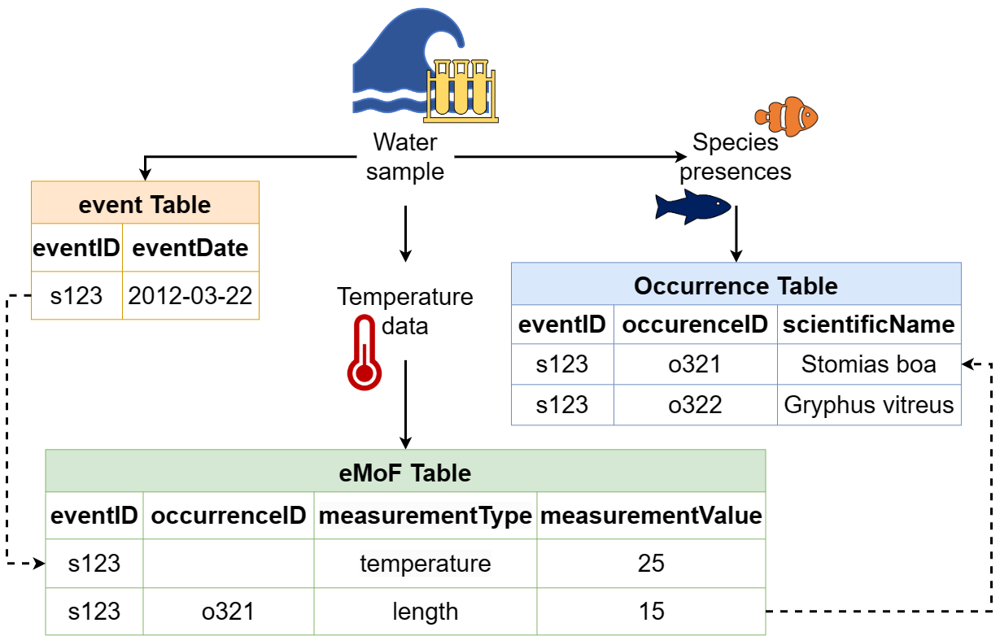
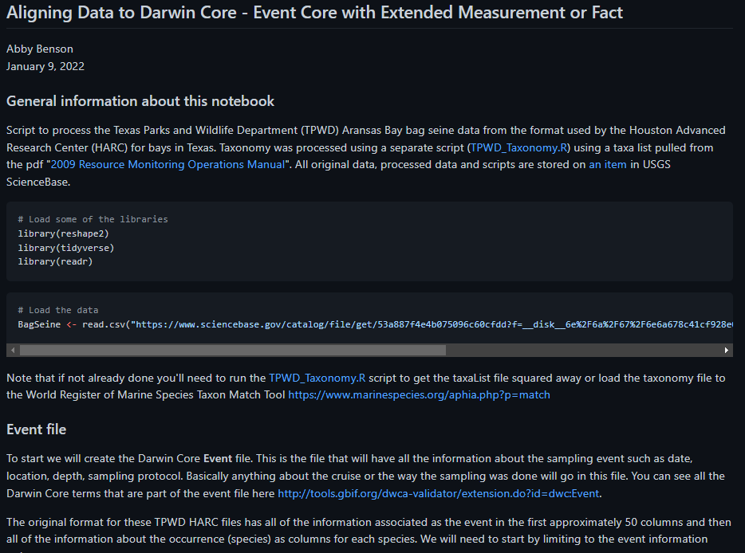

:::::::::::: questions

- What is a core and what is an extension in Darwin Core?
- What is OBIS-ENV-DATA aka (Event Core with Extended Measurement or Fact)?
- How do I create Darwin Core files?

:::::::::::::::::::::::

::::::::::: objectives

- Creating IDs.
- Creating event file, occurrence file, eMOF file.

::::::::::::::::::::::

## Darwin Core - Cores and Extensions
Now that we have a firm basis for understanding the different terms in Darwin Core the next part to understand is how 
data tables are organized and the difference between cores and extensions. You will always have a core table (Occurrence 
core or Event core) with either no extensions or several. What you choose depends on the data you have and how to 
represent it best. The original Darwin Core core is the 
[Occurrence core](https://rs.gbif.org/core/dwc_occurrence_2022-02-02.xml). Once people started using that core they 
began to see that they needed extensions to that core to best represent the data they were trying to share and 
therefore [several extensions](https://rs.gbif.org/extensions.html) have been developed (and are continuing to be 
developed). As more monitoring data has been shared over time, another core type called 
[Event core](https://rs.gbif.org/core/dwc_event_2022-02-02.xml) was added. Without getting too far into the weeds on the 
cores and extensions, what's most important to understand is that you need to pick your core type and once you do that 
then you pick the extensions to go with it. For example, if your data took place as part of an event (cruise, transects, 
etc) you will pick Event core. If there was no sampling event, then you will pick Occurrence core.

### Different options for sharing the data
#### Occurrence only
The bare minimum for sharing data to OBIS is to use the 
[Occurrence Core](https://rs.gbif.org/core/dwc_occurrence_2022-02-02.xml) with no extensions. This core type covers 
datasets that only include observations and/or specimen records where no information on sampling is available. 
**Occurrence core is also used for eDNA or DNA derived data**. 

The Occurrence core allows you to provide all the required Darwin Core terms detailed in the 
[intro section](01-introduction/index.html). You can produce a fully compliant Darwin Core version of your data using 
only the Occurrence core 
([see this example by Tylar Murray](https://github.com/ioos/bio_data_guide/blob/main/datasets/example_obis_minimum_flair/occurrences.csv)). 
On one hand, if the data were collected using some kind of sampling methodology, you will lose much of that information 
if you use this most simple form of data structuring. However, it is faster and easier to produce.

:::::::::::: callout

### Thought Experiment 
Look at the 
[minimum required fields example](https://github.com/ioos/bio_data_guide/blob/main/datasets/example_obis_minimum_flair/occurrences.csv). 
What is possible
to do in future reuse? What would not be possible? For instance, note that there is no information about depth or the 
uncertainty of the coordinates.

::::::::::::::::::::

For more examples check out the [Datasets folder](https://github.com/ioos/bio_data_guide/tree/main/datasets) in the IOOS 
Bio Data Guide.

## Occurrence Core + extensions
Using the Occurrence core plus [relevant extensions](https://rs.gbif.org/extensions.html) means that you can capture 
more of the data that's been recorded. Let's consider an environmental DNA dataset. eDNA datasets have information that 
is unique to that method and will not be represented well using Occurrence core only. To document eDNA using Darwin 
Core you should follow [this guide](https://doi.org/10.35035/doc-vf1a-nr22); you will need the Occurrence core plus the 
[DNA derived data extension](https://rs.gbif.org/extension/gbif/1.0/dna_derived_data_2022-02-23.xml). Adding the DNA 
derived data extension allows you to capture information such as the PCR primer used, DNA sequences, and other 
information specific to this type of data.

Let's consider another example: a museum dataset that has biological measurements for each individual specimen (e.g. 
length). All information about each organism's occurrence (taxonomic information, locality, identification, etc.) will 
go into the Occurrence core. You can then capture the biotic measurement information (type of measurement, units, 
accuracy, etc.) by using either the 
[Measurement or Facts extension](https://rs.gbif.org/extension/dwc/measurements_or_facts_2022-02-02.xml), or the 
[Extended Measurement or Fact extension](https://rs.gbif.org/extension/obis/extended_measurement_or_fact.xml) (we 
elaborate on this extension below). Note again here we do not have information on *how* the organisms were sampled. 

## Event Core with Extended Measurement or Fact extension
As we have indicated earlier, the Event core is for datasets that include known sampling events - details are known 
about how, when, and where samples were taken.

An innovation that OBIS made was introducing the Extended Measurement or Fact extension (also sometimes referred to as 
OBIS-ENV-DATA, or eMoF). This uses the Event core with an Occurrence extension + the 
[extended Measurement or Fact extension](https://rs.gbif.org/extension/obis/extended_measurement_or_fact.xml). The eMoF 
extension makes it possible to include measurements for **both** the events (salinity, temperature, gear type, etc.) and 
the occurrences (weight, length, etc.). Prior to this you were only able to include measurements of the occurrence (in 
the Measurement or Facts extension).

It is important to know that the structure of the eMoF table is likely quite a bit different than how the original data 
are recorded in your dataset. Rather than documenting each measurement in separate columns, measurements will be 
condensed into one column: `measurementValue` (e.g. 15). Then, the column `measurementType`  allows free text 
describing what the measurement actually is (e.g. length). Finally the column `measurementUnit` is used to indicate the 
unit of the measurement (e.g. cm).

The unconstrained nature of `measurementType` allows for flexibility in describing measurements, which can be quite a 
useful. But what if you wanted to obtain all OBIS records that have "length" measurements? Due to the inevitable 
heterogeneity in how different people document "length", you would have to try to account for all these different ways! 
Fortunately the eMoF table can get around this challenge by providing a way to include Unique Resource Identifiers 
(URIs). These URIs are used to populate the `measurementTypeID` field, as well as `measurementUnitID` and 
`measurementValueID`. URIs mean that if you call the `measurementType` "abundance" but I call it "Abundance per square 
meter" and we both use the `measurementTypeID` "http://vocab.nerc.ac.uk/collection/P01/current/SDBIOL02/" then we know 
this is the same measurement type even if we didn't use the same words to describe it. Choosing the right URI can be 
difficult but you can read about finding codes in 
[the OBIS Manual](https://manual.obis.org/vocabulary.html#map-emof-measurement-identifiers-to-preferred-bodc-vocabulary). 
All you need to know for now is that `measurementTypeID` should be populated with a URI belonging to the NERC P01 
collection, easily accessible through the [SeaDataNet P01 facet search](https://vocab.seadatanet.org/p01-facet-search), 
and `measurementUnitID` should be popualted with a 
[NERC P06 code](https://vocab.nerc.ac.uk/search_nvs/P06/?searchstr=&options=identifier,preflabel,altlabel,status_accepted&rbaddfilter=inc&searchstr2=). 
OBIS is soon releasing video tutorials to help with choosing URIs, so stay tuned to their [manual](https://manual.obis.org/) 
and [YouTube list](https://www.youtube.com/@oceanbiodiversityinformati6931/playlists) for updates.

:::::::::::: callout

## :pushpin: Tip 

You can search for `measurementTypes` that other OBIS data providers have used by using the 
[OBIS mof report](https://mof.obis.org/). BE CAREFUL though to make sure the
definition in the URI matches exactly your measurement type if you want to reuse it for your data.

::::::::::::::::::::

## What's in an ID?

| Darwin Core Term | Description | Example   |
|------------------|-------------|-----------|
| [eventID](https://dwc.tdwg.org/terms/#dwc:eventID) | An identifier for the set of information associated with an Event (something that occurs at a place and time). May be a global unique identifier or an identifier specific to the data set. | `INBO:VIS:Ev:00009375` `Station_95_Date_09JAN1997:14:35:00.000`   `FFS-216:2007-09-21:A:replicateID1024`|
|[occurrenceID](https://dwc.tdwg.org/terms/#dwc:occurrenceID)|An identifier for the Occurrence (as opposed to a particular digital record of the occurrence). In the absence of a persistent global unique identifier, construct one from a combination of identifiers in the record that will most closely make the occurrenceID globally unique.|`urn:catalog:UWBM:Bird:89776`   `Station_95_Date_09JAN1997:14:35:00.000_Atractosteus_spatula`   `FFS-216:2007-09-21:A:replicateID1024:objectID1345330`|
|[measurementID](https://dwc.tdwg.org/terms/#dwc:measurementID)| An identifier for the MeasurementOrFact (information pertaining to measurements, facts, characteristics, or assertions). May be a global unique identifier or an identifier specific to the data set.| `9c752d22-b09a-11e8-96f8-529269fb1459`|

IDs are the keys in your data that are used to link tables together. For example, an `occurenceID` in the eMoF table 
records information about an organism with the same `occurrenceID` within the Occurrence core table. IDs are also the 
keys that keep track of each of the records, so that if you notice a mistake or missing information you can keep the 
record in place in the global aggregators and fix the mistake or add the missing information. For instance, let's say 
you have a record with an `occurrenceID` `Station_95_Date_09JAN1997:14:35:00.000_Atractosteus_spatula` and after it's 
published to OBIS you notice that the latitude was recorded incorrectly. When you fix that record in the data you would 
keep the `occurrenceID` `Station_95_Date_09JAN1997:14:35:00.000_Atractosteus_spatula`, fix the latitude, and republish 
the data so that the record is still present in OBIS but you have fixed the mistake.

With that in mind what is the best way to create an `eventID`, `occurrenceID`, or `measurementID`? Until we have a system 
that mints Persistent Identififers for individual records then the best way we have seen is to build the ID from 
information in the data itself. That way if you need to update or fix a record you simply use the same information 
again to build the same ID for the same record. Take our example above 
`Station_95_Date_09JAN1997:14:35:00.000_Atractosteus_spatula`. This is a concatenation of information from the original 
source data of the Station number + Verbatim Date + Scientific name. Because this is unique for each row in the 
occurrence file and we have kept the original data in its original format we can always rebuild this ID by concatenating 
this same information together again.

**It is very important that these IDs do not change over time**. So if an ID for a museum specimen is built from 
e.g. the institution the specimen is being held at, but then the specimen changes institutions - its ID should **not** 
change to reflect the move. If the ID changes then the record will be duplicated in the global database and record 
information could be lost over time!

*The Darwin Core file structure, demonstrating how an Event core table can be connected to extension tables through the 
use of identifiers. Image credit: [OBIS](https://manual.obis.org/)*

:::::::::::: spoiler

## Event Core

| Darwin Core Term | Definition | Comment | Example |
|------------------|------------------------------------|---------------------------------------|-----------------|
| [`eventID`](https://dwc.tdwg.org/terms/#dwc:eventID) | An identifier for the set of information associated with an Event (something that occurs at a place and time). May be a global unique identifier or an identifier specific to the data set.| To construct a globally unique identifier for each event (tow, quadrat, station, transect, etc) you can usually concatenate station + date but you'll need to check this is unique for each row in your data. | `INBO:VIS:Ev:00009375` `Station_95_Date_09JAN1997:14:35:00.000`   `FFS-216:2007-09-21:A:replicateID1024`|
| [`eventDate`](https://dwc.tdwg.org/terms/#dwc:eventDate) | The date-time or interval during which an Event occurred. For occurrences, this is the date-time when the event was recorded. Not suitable for a time in a geological context. | Must follow [ISO 8601](https://en.wikipedia.org/wiki/ISO_8601). See more information on dates in the [Data Cleaning](03-data-cleaning/index.html) section of the workshop. | `2009-02-20T08:40Z` |
| [`decimalLatitude`](https://dwc.tdwg.org/terms/#dwc:decimalLatitude) | The geographic latitude (in decimal degrees, using the spatial reference system given in geodeticDatum) of the geographic center of a Location. Positive values are north of the Equator, negative values are south of it. Legal values lie between -90 and 90, inclusive. | For OBIS and GBIF the required `geodeticDatum` is WGS84. Uncertainty around the geographic center of a Location (e.g. when sampling event was a transect) can be recorded in `coordinateUncertaintyInMeters`. See more information on coordinates in the [Data Cleaning](03-data-cleaning/index.html) section of the workshop. | `-41.0983423`  |
| [`decimalLongitude`](https://dwc.tdwg.org/terms/#dwc:decimalLongitude) | The geographic longitude (in decimal degrees, using the spatial reference system given in geodeticDatum) of the geographic center of a Location. Positive values are east of the Greenwich Meridian, negative values are west of it. Legal values lie between -180 and 180, inclusive | For OBIS and GBIF the required `geodeticDatum` is WGS84. See more information on coordinates in the [Data Cleaning](03-data-cleaning/index.html) section of the workshop. | `-121.1761111` |
| [`countryCode`](https://dwc.tdwg.org/terms/#dwc:countryCode) | The standard code for the country in which the location occurs. | Use an [ISO 3166-1-alpha-2](https://en.wikipedia.org/wiki/ISO_3166-1_alpha-2) country code. Not required for OBIS but GBIF needs this for their system. | `US` |
| [`geodeticDatum`](https://dwc.tdwg.org/terms/#dwciri:geodeticDatum) | The ellipsoid, geodetic datum, or spatial reference system (SRS) upon which the geographic coordinates given in decimalLatitude and decimalLongitude as based. | Must be [WGS84](https://epsg.io/4326) for data shared to OBIS and GBIF but it's best to state explicitly that it is. | `WGS84` |

::::::::::::::::::::

:::::::::::: spoiler

## Occurrence extension
 
| Darwin Core Term | Definition | Comment | Example |
|------------------|------------------------------------|---------------------------------------|-----------------|
| [`eventID`](https://dwc.tdwg.org/terms/#dwc:eventID) | An identifier for the set of information associated with an Event (something that occurs at a place and time). May be a global unique identifier or an identifier specific to the data set.| This will be constructed in the event core but you need to reference it here in the occurrence extension so the files can link to each other correctly. | `INBO:VIS:Ev:00009375` `Station_95_Date_09JAN1997:14:35:00.000`   `FFS-216:2007-09-21:A:replicateID1024`|
| [`occurrenceID`](https://dwc.tdwg.org/terms/#dwc:occurrenceID) | An identifier for the Occurrence (as opposed to a particular digital record of the occurrence). In the absence of a persistent global unique identifier, construct one from a combination of identifiers in the record that will most closely make the occurrenceID globally unique. | To construct a globally unique identifier for each occurrence you can usually concatenate station + date + scientific name (or something similar) but you'll need to check this is unique for each row in your data. | `Station_95_Date_09JAN1997:14:35:00.000_Atractosteus_spatula` |
| [`basisOfRecord`](https://dwc.tdwg.org/terms/#dwc:basisOfRecord) | The specific nature of the data record. | Pick from these controlled vocabulary terms: [HumanObservation](http://rs.tdwg.org/dwc/terms/HumanObservation), [MachineObservation](http://rs.tdwg.org/dwc/terms/MachineObservation), [PreservedSpecimen](http://rs.tdwg.org/dwc/terms/PreservedSpecimen), [LivingSpecimen](http://rs.tdwg.org/dwc/terms/LivingSpecimen), [FossilSpecimen](http://rs.tdwg.org/dwc/terms/FossilSpecimen), [MaterialSample](http://rs.tdwg.org/dwc/dwctype/MaterialSample), [Occurrence](http://rs.tdwg.org/dwc/dwctype/Occurrence), [MaterialCitation](http://rs.tdwg.org/dwc/dwctype/MaterialCitation) | `HumanObservation` |
| [`scientificName`](https://dwc.tdwg.org/terms/#dwc:scientificName) | The full scientific name, with authorship and date information if known. When forming part of an Identification, this should be the name in lowest level taxonomic rank that can be determined. This term should not contain identification qualifications, which should instead be supplied in the `identificationQualifier` term. | Note that cf., aff., etc. need to be parsed out to the `identificationQualifier` term. | `Atractosteus spatula` |
| [`scientificNameID`](https://dwc.tdwg.org/terms/#dwc:scientificNameID) | An identifier for the nomenclatural (not taxonomic) details of a scientific name. | Must be a WoRMS LSID for sharing to OBIS. Note that the numbers at the end are the AphiaID from WoRMS. | `urn:lsid:marinespecies.org:taxname:218214` |
| [`kingdom`](https://dwc.tdwg.org/terms/#dwc:kingdom) | The full scientific name of the kingdom in which the taxon is classified.| Not required for OBIS but GBIF needs this to disambiguate scientific names that are the same but in different kingdoms. | `Animalia` |
| [`occurrenceStatus`](https://dwc.tdwg.org/terms/#dwc:occurrenceStatus) | A statement about the presence or absence of a Taxon at a Location. | For OBIS, only valid values are `present` and `absent`. | `present` |

::::::::::::::::::::

:::::::::::: spoiler

## Extended Measurement or Fact Extension

Nothing is *required* from the OBIS perspective but if you are using this extension then `eventID` is required to be 
able to link the extension back to the Event core. You can also use `occurrenceID` to link to occurrence records in 
the Occurrence core or extension. See [here](https://rs.gbif.org/extension/obis/extended_measurement_or_fact.xml) for 
all potential fields in the extension and what goes in them. See below of the most relevant terms to be included in the 
eMoF table.
 
| Darwin Core Term | Definition | Comment | Example |
|------------------|------------------------------------|---------------------------------------|-----------------|
| `eventID` | An identifier for the set of information associated with an Event (something that occurs at a place and time). May be a global unique identifier or an identifier specific to the data set.| This will be constructed in the Event core but you need to reference it here in the extension so the files can link to each other correctly. | `INBO:VIS:Ev:00009375` `Station_95_Date_09JAN1997:14:35:00.000`   `FFS-216:2007-09-21:A:replicateID1024`|
| `occurrenceID` | The identifier of the occurrence the measurement or fact refers to. If not applicable, it should be left empty. | Only needed if you have measurements that you need to link back to an occurrence like weight, length, abundance, etc. | `urn:catalog:UWBM:Bird:89776`   `Station_95_Date_09JAN1997:14:35:00.000_Atractosteus_spatula`   `FFS-216:2007-09-21:A:replicateID1024:objectID1345330` |
| `measurementID` | An identifier for the MeasurementOrFact (information pertaining to measurements, facts, characteristics, or assertions). May be a global unique identifier or an identifier specific to the data set. | This is not necessarily required when creating the eMoF but it can be useful, especially if you would like a way to identify a specific measurement in the data | `9c752d22-b09a-11e8-96f8-529269fb1459` |
| `measurementType` | The nature of the measurement, fact, characteristic, or assertion. Recommended best practice is to use a controlled vocabulary. |  | `temperature`  `salinity`  `length`  `device type`|
| `measurementTypeID` | An identifier for the measurementType (global unique identifier, URI). The identifier should reference the measurementType in a vocabulary. | OBIS uses NERC to provide these but you can use other vocabularies or ontologies like ENVO or others. When using NERC vocabulary terms, you must choose a term from the P01 collection. | `http://vocab.nerc.ac.uk/collection/P01/current/TEMPPR01/`  `http://vocab.nerc.ac.uk/collection/P01/current/ODSDM021/	`  `http://vocab.nerc.ac.uk/collection/P01/current/OBSINDLX/`   ``|
| `measurementValue` | The value of the measurement, fact, characteristic, or assertion |  | `20`  `61.5`  `121`  `Van Veen grab` |
| `measurementValueID` | An identifier for facts stored in the column measurementValue (global unique identifier, URI). This identifier can reference a controlled vocabulary (e.g. for sampling instrument names, methodologies, life stages) or reference a methodology paper with a DOI. When the measurementValue refers to a value and not to a fact, the **measurementvalueID has no meaning and should remain empty**. |  | `http://vocab.nerc.ac.uk/collection/L22/current/TOOL0653/`|
| `measurementAccuracy` | The description of the potential error associated with the measurementValue. |  | `0.01 C` `0.03`  `5 mm`|
| `measurementUnit` | The units associated with the measurementValue. Recommended best practice is to use the International System of Units (SI). |  | `C`  `PPT`  `mm` |
| `measurementUnitID` | An identifier for the measurementUnit (global unique identifier, URI). The identifier should reference the measurementUnit in a vocabulary. | Recommended practice is populate this field with a term from NERC vocablary's P06 collection | `http://vocab.nerc.ac.uk/collection/P06/current/UPAA/` `http://vocab.nerc.ac.uk/collection/P06/current/UPPT/`  `http://vocab.nerc.ac.uk/collection/P06/current/UXMM/` |

::::::::::::::::::::

Over at the [IOOS Bio Data Guide repository](https://github.com/ioos/bio_data_guide) you can see [a script](https://github.com/ioos/bio_data_guide/blob/main/datasets/TPWD_HARC_BagSeine/TPWD_HARC_BagSeine_OBISENV.md) that was used to take data in its original form and align it to Darwin Core Event Core with Extended Measurement or Fact. More information on how to organize data fields into Event and Measurement or Fact can be found in the [OBIS Manual](https://manual.obis.org/)

*A screenshot of the script available for aligning data to Darwin Core.

::::::::::::: keypoints

- Darwin Core uses cores and extensions to model the multitude of biological observation data that exists.
- OBIS uses the Event (or Occurrence) Core with the Extended Measurement or Fact extension to make sure no information is lost.
- Additional fields are required and put into different files when using a Core with the Extended Measurement or Fact extension.
- ID fields are important keys in your data and we recommend building them from the information in your data.

:::::::::::::::::::::::