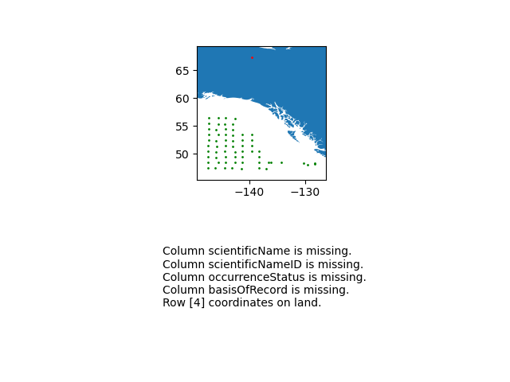

:::::::::::: questions

- How can I QC my data?

::::::::::::::::::::::

:::::::::::: objectives

- "Data enhancement and quality control"

:::::::::::::::::::::::

## Data enhancement and quality control

OBIS performs a number of quality checks on the data it receives. Red quality flags are attached to occurrence records if errors are encountered, and records may also be rejected if they do not meet minimum requirements. The checks that OBIS performs are documented [here](https://www.ncbi.nlm.nih.gov/pmc/articles/PMC4309024/pdf/bau125.pdf) and a python implementation is available [here](https://github.com/iobis/obis-qc). Therefore, prior to publishing your data to OBIS and/or GBIF, it is important to perform quality control on your standardized data. This can help identify any outliers or "faulty" data. It will also help with ensuring that your data is compatible and interoperable with other datasets published to OBIS. There are numerous functions within the [obistools](https://github.com/iobis/obistools) R packages that can serve to identify outliers, inspect quality or ensure that the dataset structure fits the required format for both the Event and Occurrence tables. 

:::::::::::: callout

### :pushpin: Recommended initial checks on your data

* Check that all the [required Darwin Core terms](01-introduction/index.html#what-are-the-required-darwin-core-terms-for-publishing-to-obis) are present and contain the correct information.
* Make a map from your data to ensure the coordinates are valid and within your expected range.
* Run basic statistics on each column of numeric data (min, max, mean, std. dev., etc.) to identify potential issues.
* Look at unique values of columns containing string entries to identify potential issues (eg. spelling). 
* Check for uniqueness of `occurrenceID` field.
* Check for uniqueness of `eventID` for each event, if applicable. 
* Check that dates are following [ISO-8601](https://en.wikipedia.org/wiki/ISO_8601).
* Check that the `scientificNameID` is/are valid. 

::::::::::::::::::::

One method for reviewing your data is to use the r package [Hmisc](https://cran.r-project.org/web/packages/Hmisc/index.html) and the function [describe](https://rdrr.io/cran/Hmisc/man/describe.html). Expand the example below using output from [this notebook](https://github.com/ioos/bio_data_guide/blob/main/datasets/TPWD_HARC_BagSeine/TPWD_HARC_BagSeine_OBISENV.md) to see how it works.

::::::::::::::::: spoiler

### Hmisc::describe

```r
# pull in the occurrence file from https://www.sciencebase.gov/catalog/item/53a887f4e4b075096c60cfdd
url <- "https://www.sciencebase.gov/catalog/file/get/53a887f4e4b075096c60cfdd?f=__disk__32%2F24%2F80%2F322480c9bcbad19030e29c9ec5e2caeb54cb4a08&allowOpen=true"

occurrence <- read.csv(url)

head(occurrence,n=1)       
  vernacularName                                eventID occurrenceStatus
1  Alligator gar Station_95_Date_09JAN1997:14:35:00.000           Absent
     basisOfRecord       scientificName
1 HumanObservation Atractosteus spatula
                           scientificNameID  kingdom   phylum       class
1 urn:lsid:marinespecies.org:taxname:279822 Animalia Chordata Actinopteri
             order        family        genus scientificNameAuthorship
1 Lepisosteiformes Lepisosteidae Atractosteus        (LacepA"de, 1803)
  taxonRank organismQuantity organismQuantityType
1   Species                0   Relative Abundance
                                                 occurrenceID
1 Station_95_Date_09JAN1997:14:35:00.000_Atractosteus_spatula
         collectionCode
1 Aransas Bay Bag Seine

Hmisc::describe(occurrence)
```
```output
occurrence 

 18  Variables      334341  Observations
--------------------------------------------------------------------------------
vernacularName
       n  missing distinct
  334341        0       61

lowest : Alligator gar        Arrow shrimp         Atlantic brief squid Atlantic bumper      Atlantic croaker
highest: Striped mullet       Thinstripe hermit    Threadfin shad       White mullet         White shrimp
--------------------------------------------------------------------------------
eventID
       n  missing distinct
  334341        0     5481

lowest : Station_10_Date_04DEC1991:13:59:00.000 Station_10_Date_04SEP2002:13:17:00.000 Station_10_Date_05JUN1991:15:20:00.000 Station_10_Date_07APR1995:12:54:00.000 Station_10_Date_07APR2000:11:16:00.000
highest: Station_99_Date_21APR1998:18:24:00.000 Station_99_Date_22OCT2001:13:12:00.000 Station_99_Date_25JUN1990:13:48:00.000 Station_99_Date_25NOV2003:11:11:00.000 Station_99_Date_27JUN1988:12:45:00.000
--------------------------------------------------------------------------------
occurrenceStatus
       n  missing distinct
  334341        0        2

Value       Absent Present
Frequency   294469   39872
Proportion   0.881   0.119
--------------------------------------------------------------------------------
basisOfRecord
               n          missing         distinct            value
          334341                0                1 HumanObservation 

Value      HumanObservation
Frequency            334341
Proportion                1
--------------------------------------------------------------------------------
scientificName
       n  missing distinct
  334341        0       61

lowest : Adinia xenica               Anchoa mitchilli            Archosargus probatocephalus Ariopsis felis              Atractosteus spatula
highest: Stomatopoda                 Stomolophus meleagris       Syngnathus scovelli         Tozeuma carolinense         Trichiurus lepturus
--------------------------------------------------------------------------------
scientificNameID 
       n  missing distinct
  334341        0       61

lowest : urn:lsid:marinespecies.org:taxname:105792 urn:lsid:marinespecies.org:taxname:107034 urn:lsid:marinespecies.org:taxname:107379 urn:lsid:marinespecies.org:taxname:126983 urn:lsid:marinespecies.org:taxname:127089
highest: urn:lsid:marinespecies.org:taxname:367528 urn:lsid:marinespecies.org:taxname:396707 urn:lsid:marinespecies.org:taxname:421784 urn:lsid:marinespecies.org:taxname:422069 urn:lsid:marinespecies.org:taxname:443955

--------------------------------------------------------------------------------
kingdom
       n  missing distinct    value
  334341        0        1 Animalia

Value      Animalia
Frequency    334341
Proportion        1
--------------------------------------------------------------------------------
phylum
       n  missing distinct
  328860     5481        4

Value      Arthropoda   Chordata   Cnidaria   Mollusca
Frequency       71253     246645       5481       5481
Proportion      0.217      0.750      0.017      0.017
--------------------------------------------------------------------------------
class
       n  missing distinct
  328860     5481        5

lowest : Actinopteri    Cephalopoda    Elasmobranchii Malacostraca   Scyphozoa     
highest: Actinopteri    Cephalopoda    Elasmobranchii Malacostraca   Scyphozoa

Value         Actinopteri    Cephalopoda Elasmobranchii   Malacostraca
Frequency          235683           5481          10962          71253
Proportion          0.717          0.017          0.033          0.217

Value           Scyphozoa
Frequency            5481
Proportion          0.017
--------------------------------------------------------------------------------
order
       n  missing distinct
  328860     5481       22

lowest : Atheriniformes            Batrachoidiformes         Carangaria incertae sedis Carangiformes             Carcharhiniformes        
highest: Rhizostomeae              Scombriformes             Siluriformes              Syngnathiformes           Tetraodontiformes
--------------------------------------------------------------------------------
family
       n  missing distinct
  328860     5481       36

lowest : Ariidae        Atherinopsidae Batrachoididae Carangidae     Carcharhinidae
highest: Stromateidae   Syngnathidae   Tetraodontidae Trichiuridae   Triglidae
--------------------------------------------------------------------------------
genus
       n  missing distinct
  328860     5481       52

lowest : Adinia       Anchoa       Archosargus  Ariopsis     Atractosteus
highest: Sphoeroides  Stomolophus  Syngnathus   Tozeuma      Trichiurus  
--------------------------------------------------------------------------------
scientificNameAuthorship
       n  missing distinct
  328860     5481       52

lowest : (Baird & Girard, 1853)        (Baird & Girard, 1855)        (Blainville, 1823)            (Bosc, 1801)                  (Burkenroad, 1939)
highest: Rathbun, 1896                 Say, 1817 [in Say, 1817-1818] Shipp & Yerger, 1969          Valenciennes, 1836            Winchell, 1864
--------------------------------------------------------------------------------
taxonRank
       n  missing distinct
  334341        0        3

Value        Genus   Order Species
Frequency     5481    5481  323379
Proportion   0.016   0.016   0.967
--------------------------------------------------------------------------------
organismQuantity
       n  missing distinct     Info     Mean      Gmd      .05      .10
  334341        0     8696    0.317  0.01639  0.03141  0.00000  0.00000
     .25      .50      .75      .90      .95
 0.00000  0.00000  0.00000  0.01005  0.07407

lowest : 0.0000000000 0.0000917684 0.0001835370 0.0002136300 0.0002241650
highest: 0.9969931270 0.9974226800 0.9981570220 0.9982300880 1.0000000000
--------------------------------------------------------------------------------
organismQuantityType 
                 n            missing           distinct              value
            334341                  0                  1 Relative Abundance

Value      Relative Abundance
Frequency              334341
                    n               missing              distinct
              334341                     0                     1
                value
Aransas Bay Bag Seine

Value      Aransas Bay Bag Seine
Frequency                 334341
Proportion                     1
--------------------------------------------------------------------------------
```

:::::::::::::::::::::::::

::::::::::::::::::::::::::::::::: challenge

### Exercise 

Perform the following minimal quality assurance and control checks: 
 
1. Run a diagnostics report for the data quality. 
1. Ensure that the eventIDs are unique. 
1. Make sure that the eventDates follow ISO-8601 standards. 
1. Determine whether reported depths are accurate. 
 
The event core data used in the checks below can be found in [this Excel file](data/trawl_fish.xlsx).

::::::::::::::::: solution

::::::::::::::::: tab

#### R

Install [obistools](https://github.com/iobis/obistools) R packages. 
Use [readxl](https://readxl.tidyverse.org/) package to read the Excel file.

1. Run a diagnostics report for the data quality
   ```r
   library(readxl)
   library(obistools)
   
   trawl_fish <- readxl::read_excel('data/trawl_fish.xlsx')
   report <- obistools::report(trawl_fish)
   report
   ```
   
   

1. Check to make sure `eventID` are unique
   ```r
   eventid <- obistools::check_eventids(trawl_fish)
   head(eventid)
   ```
   ```output
   # A tibble: 6 x 4
    field         level   row message                                                    
    <chr>         <chr> <int> <chr>                                                      
    1 eventID       error     7 eventID IYS:GoA2019:Stn6:trawl is duplicated               
    2 eventID       error     8 eventID IYS:GoA2019:Stn6:trawl is duplicated               
    3 parentEventID error     1 parentEventID IYS:GoA2019:Stn1 has no corresponding eventID
    4 parentEventID error     2 parentEventID IYS:GoA2019:Stn2 has no corresponding eventID
    5 parentEventID error     3 parentEventID IYS:GoA2019:Stn3 has no corresponding eventID
    6 parentEventID error     4 parentEventID IYS:GoA2019:Stn4 has no corresponding eventID
   ```
   
1. Check for proper `eventDate` to ensure they follow ISO 8601 standards:
    ```r
    eventDate <- obistools::check_eventdate(trawl_fish)
    print(eventDate)  
    ```
    ```output
    # A tibble: 3 x 4
     level   row field     message                                                       
     <chr> <int> <chr>     <chr>                                                         
    1 error    10 eventDate eventDate 2019-02-24T07u40 does not seem to be a valid date   
    2 error    13 eventDate eventDate 2019-02-25 11h25min does not seem to be a valid date
    3 error    15 eventDate eventDate 2019-26-2 does not seem to be a valid date    
    ```
   
1. From the report generated under exercise 1, you can already see that there's measurements made on land. This information can also be gathered by plotting the map separately or using the `check_onland()` or `check_depth()` functions in the [obistools](https://iobis.github.io/obistools/) package.    
    ```r
    depth <- obistools::check_depth(trawl_fish)
    onland <- obistools::check_onland(trawl_fish) # Gives the same output.           
    print(depth)  
    ```
    ```output
    # A tibble: 1 x 16
     eventID parentEventID eventDate  year month   day decimalLatitude decimalLongitude footprintWKT coordinateUncer~ minimumDepthInM~
     <chr>   <chr>         <chr>     <dbl> <dbl> <dbl>           <dbl>            <dbl> <chr>                   <dbl>            <dbl>
    1 IYS:Go~ IYS:GoA2019:~ 2019-02-~  2019     2    22            67.4            -140. LINESTRING ~            2313.                0
    # ... with 5 more variables: maximumDepthInMeters <dbl>, samplingProtocol <chr>, locality <chr>, locationID <chr>, type <chr>    
    ```    

#### Python

Install the [pandas](https://pandas.pydata.org/), 
[cartopy](https://scitools.org.uk/cartopy/docs/latest/installing.html), and 
[geopandas](https://geopandas.org/en/stable/) Python packages. 
Use pandas to read the Excel file.

```python
import pandas as pd
url = 'https://ioos.github.io/bio_mobilization_workshop/data/trawl_fish.xlsx'
df = pd.read_excel(url) # might need to install openpyxl
df['row'] = df.index.to_numpy()+1 # python starts at zero
```

1. Run a diagnostics report for the data quality.
   ```python
   import cartopy.io.shapereader as shpreader
   import geopandas as gpd
   import shapely.geometry as sgeom
   from shapely.ops import unary_union
   from shapely.prepared import prep
   import matplotlib.pyplot as plt
   
   gdf = gpd.GeoDataFrame(df, geometry=gpd.points_from_xy(df.decimalLongitude, df.decimalLatitude))
   
   land_shp_fname = shpreader.natural_earth(resolution='50m',
                                          category='physical', name='land')
   
   land_geom = unary_union(list(shpreader.Reader(land_shp_fname).geometries()))
   land = prep(land_geom)
   
   for index, row in gdf.iterrows():
       gdf.loc[index, 'on_land'] = land.contains(row.geometry)
   
   fig, axs = plt.subplots(ncols=1,nrows=2)
   # Make a map:
   xlim = ([gdf.total_bounds[0]-2,  gdf.total_bounds[2]+2])
   ylim = ([gdf.total_bounds[1]-2,  gdf.total_bounds[3]+2])
   
   axs[0].set_xlim(xlim)
   axs[0].set_ylim(ylim)

   gpd.read_file(land_shp_fname).plot(ax=axs[0])
   
   gdf.loc[gdf['on_land']==False].plot(ax=axs[0], color='green', markersize=1)
   gdf.loc[gdf['on_land']==True].plot(ax=axs[0], color='red', markersize=1)
   
   # Collect some informational material about potential issues w/ data:
   invalid_coord = []
   if len(gdf.loc[gdf['on_land']==True]) > 0:
      invalid_coord.append('Row {} coordinates on land.'.format(gdf.loc[gdf['on_land'] == True,'row'].tolist()[0]))
    
   req_cols = ['eventDate', 'decimalLongitude', 'decimalLatitude', 'scientificName', 'scientificNameID', 'occurrenceStatus', 'basisOfRecord']
   missing_cols = []
   for col in req_cols:
    if col not in gdf.columns:
      missing_cols.append('Column {} is missing.'.format(col))
   
   # Add the information to the figure
   axs[1].text(0.25,0.25,'\n'.join(['\n'.join(missing_cols),'\n'.join(invalid_coord)]))
   axs[1].axis('off')
   plt.show()
   ```
   
    
    
1. Check to make sure `eventID` are unique
   ```python
   dup_events = df.loc[df['eventID'].duplicated()]
   print('Duplicated eventID:\n',dup_events[['eventID','row']])
   
   parent_not_event = df.loc[~df['eventID'].isin(df['parentEventID'].unique())]
   print('\nparentEventID missing corresponding eventID:\n', parent_not_event[['parentEventID','row']])
   ```
   ```output
   Duplicated eventID:
                      eventID  row
   6  IYS:GoA2019:Stn6:trawl    7
   7  IYS:GoA2019:Stn6:trawl    8
   
   parentEventID missing corresponding eventID:
            parentEventID  row
   0    IYS:GoA2019:Stn1    1
   1    IYS:GoA2019:Stn2    2
   2    IYS:GoA2019:Stn3    3
   3    IYS:GoA2019:Stn4    4
   4    IYS:GoA2019:Stn5    5
   ..                ...  ...
   59  IYS:GoA2019:Stn60   60
   60  IYS:GoA2019:Stn61   61
   61  IYS:GoA2019:Stn62   62
   62  IYS:GoA2019:Stn63   63
   63  IYS:GoA2019:Stn64   64
   [64 rows x 2 columns]
   ```
   
1. Check for proper `eventDate` to ensure they follow ISO 8601 standards:
   ```python
   for date in df['eventDate']:
       try:
           pd.to_datetime(date)
       except:
           print("Date",date,"might not follow ISO 8601")
   ```
   
1. From the report generated under exercise 1, you can already see that there’s measurements made on land. Now let's check the depths are within reason for the points. Let's use the [GEBCO bathymetry dataset served in the coastwatch ERDDAP](https://coastwatch.pfeg.noaa.gov/erddap/griddap/GEBCO_2020.html).
   ```python
   import time
   import numpy as np
   
   df['bathy'] = np.nan # initialize column
   
   for index, row in df.iterrows():
       base_url = 'https://coastwatch.pfeg.noaa.gov/erddap/griddap/GEBCO_2020.csvp?'
       query_url = 'elevation%5B({})%5D%5B({})%5D'.format(row['decimalLatitude'],row['decimalLongitude'])
       url = base_url+query_url
       bathy = pd.read_csv(url)
       df.at[index,'bathy'] = bathy['elevation (m)'] # insert bathymetry value
       time.sleep(0.5) # to not ping erddap too much
   
   # make new column for depth in meters as negative because GEBCO is Elevation relative to sea level
   df['neg_maximumDepthInMeters'] = -1*df['maximumDepthInMeters']
   
   print('maximumDepthInMeters deeper than GEBCO bathymetry:')
   if len( df.loc[df['neg_maximumDepthInMeters'] < df['bathy']] ) > 0:
      print(df.loc[df['neg_maximumDepthInMeters'] < df['bathy']].T)
   else:
      print('None')
   ```
   ```output
   maximumDepthInMeters deeper than GEBCO bathymetry:
                                                                                 4
   eventID                                                  IYS:GoA2019:Stn5:trawl
   parentEventID                                                  IYS:GoA2019:Stn5
   eventDate                             2019-02-22T09:49:00Z/2019-02-22T10:49:00Z
   year                                                                       2019
   month                                                                         2
   day                                                                          22
   decimalLatitude                                                       67.399004
   decimalLongitude                                                    -139.552501
   footprintWKT                   LINESTRING ( -139.583 67.397 , -139.522 67.401 )
   coordinateUncertaintyInMeters                                       2313.094678
   minimumDepthInMeters                                                          0
   maximumDepthInMeters                                                       33.2
   samplingProtocol                                                 midwater trawl
   locality                                                                    NaN
   locationID                                                                  NaN
   type                                                             midwater trawl
   row                                                                           5
   bathy                                                                     306.0
   neg_maximumDepthInMeters                                                  -33.2
   ```

:::::::::::::::::::::

::::::::::::::::::::::::::

:::::::::::::::::::::::::::::::::::::::::::

:::::::::::: callout

### :pushpin: Tip

* In some cases you'll want to ensure the values are representative of the entity you are reporting.
* For example, [`individualCount`](https://dwc.tdwg.org/terms/#dwc:individualCount) should be an integer. So, checking that column for integer values would be good.

:::::::::::::::::::::
  
::::::::::::: keypoints

- Several packages (e.g. obistools, Hmisc, pandas) can be used to QA/QC data.

:::::::::::::::::::::::