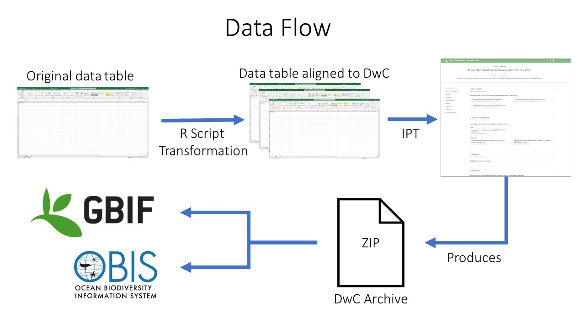

:::::::::::: questions

- How are my data published?
- What metadata are required for publishing?

::::::::::::::::::::::

::::::::::: objectives

- Showing data publishing pipeline
- Introducing the IPT
- Introduction to EML

::::::::::::::::::::::

## Data Publishing Pipeline

 After going through QAQC and being standardized to Darwin Core, the dataset are uploaded to an IPT.  
 Metadata is added in the form of EML and the dataset published as a Darwin Core Archive (DwC-A).  The data are then 
 pushed to central OBIS.  Each dataset also has the option of being pushed to GBIF by registering the resource with 
 GBIF in the IPT.  

*Data publishing pipeline. Image credit: Enrique Montes*

## Integrated Publishing Toolkit

The [Integrated Publishing Toolkit (IPT)](https://www.gbif.org/ipt) is an open-source web application developed and 
maintained by the Global Biodiversity Information Facility (GBIF) for publishing biodiversity data. The IPT makes it 
easy to share four types of biodiversity-related information:

- primary taxon occurrence data
- sampling event data
- general metadata about data sources
- taxon checklists

GBIF maintains a very detailed [IPT manual](https://ipt.gbif.org/manual/en/ipt/latest/) and the 
[OBIS Manual](https://manual.obis.org/data_publication.html) offers OBIS-specific details on publishing through the IPT. 
You can choose to download and install your own instance of the IPT but it might be complicated to register it with 
OBIS. Instead it's recommended to work with one of the OBIS nodes to publish your data through their IPT. 
[OBIS nodes](https://obis.org/contact/) publish data that are logical for their region or theme. After publishing the 
data through their IPT the data are harvested by central OBIS.

The requirements for publishing via an OBIS node IPT are that:

1. you have contacted the node to ensure the data are a good fit for that node
2. the data follows Darwin Core (DwC) and Ecological Metadata Language (EML)
3. includes the required Darwin Core and EML metadata elements

## Ecological Metadata Language (EML) 

Both OBIS and GBIF use [Ecological Metadata Language (EML)](https://eml.ecoinformatics.org/) as the metadata standard 
associated with the data. For the purposes of this workshop we will not dive into the world of EML. However, we should 
note that when publishing your data through the IPT, the IPT helps you create an EML file as part of the DwC-A. As such, 
if you publish your own data through the IPT, there is no need for innate knowledge on the EML format. But there are a 
minimum required number of fields that would need to be filled out in the IPT: `title`, `abstract`, `citation`, and 
several `contacts`. 

More information on EML can be found at the [EML standard page](https://eml.ecoinformatics.org/), and in the 
[bio data guide](https://ioos.github.io/bio_data_guide/extras.html#ecological-metadata-language-eml). There are also a 
number of R packages for working with EML, reviewed 
[here](https://livingnorway.github.io/LivingNorwayR/articles/EML_R_packages_overview.html).

:::::::::::: callout

### :pushpin: Tip 

Try to collect as much of this information as possible before and during the Darwin Core alignment process. It will 
significantly reduce the amount of time it takes to load the data into the IPT.

::::::::::::::::::::

### Required EML metadata fields for sharing to OBIS

_Best practices for these fields are explained in detail in the [OBIS manual](https://manual.obis.org/eml)_

| EML Fields | Definition | Comment |
| ---------- | ---------- | ------- |
| `Title` | A good descriptive title is indispensable and can provide the user with valuable information, making the discovery of data easier. | The IPT also requires you to provide a Shortname. Shortnames serve as an identifier for the resource within the IPT installation and should be unique, descriptive and short (max. 100 characters). Spell out acronyms in Title but they are ok to use in the shortname. |
| `Abstract` | The abstract or description of a dataset provides basic information on the content of the dataset. The information in the abstract should improve understanding and interpretation of the data.| |
| `Data License` | The license that you apply to the resource. The license provides a standardized way to define appropriate uses of your work. | Must use CC-0, CC-BY, or CC-BY-NC. Description of the licenses can be found [here](https://manual.obis.org/policy.html#data-sharing-agreement). |
| `Resource Contact(s)` | The list of people and organizations that should be contacted to get more information about the resource, that curate the resource or to whom putative problems with the resource or its data should be addressed. | Last name, Position, and Organization are required, helpful to include an ORCID and a contact method like email or phone number. |
| `Resource Creator(s)` | The people and organizations who created the resource, in priority order. The list will be used to auto-generate the resource citation (if auto-generation is turned on). | |
| `Metadata Provider(s)` | the people and organizations responsible for producing the resource metadata. | |
| `Citation` | The dataset citation allows users to properly cite the datasets in further publications or other uses of the data. The OBIS download function provides a list of the dataset citations packaged with the data in a zipped file. | |

### Other EML fields to consider

| EML Fields               | Definition | Comment |
|--------------------------|------------|---------|
| `Bounding Box`           | Farthest North, South, East, and West coordinate. |  |
| `Geographic Description` | A textual description of the geographic coverage.  |  |
| `Temporal Coverage`      | This can either be a Single Date, Date Range, Formation Period, or Living Time Period. |  |
| `Study Extent`           | This field represents both a specific sampling area and the sampling frequency (temporal boundaries, frequency of occurrence) of the project. |  |
| `Sampling Description`   | This field allows for a text-based/human readable description of the sampling procedures used in the research project. | The content of this element would be similar to a description of sampling procedures found in the methods section of a journal article.  |
| `Step Description`       | This field allows for repeated sets of elements that document a series of methods and procedures used in the study, and the processing steps leading to the production of the data files. These include e.g. text descriptions of the procedures, relevant literature, software, instrumentation and any quality control measurements taken. | Each method should be described in enough detail to allow other researchers to interpret and repeat the study, if required. |

::::::::::::: keypoints

- The IPT is a well-documented and flexible system for publishing data to OBIS
- Some Darwin Core and Ecological Metadata Language fields are required for publishing to OBIS.
- Strive to write more than the minimal metadata

:::::::::::::::::::::::